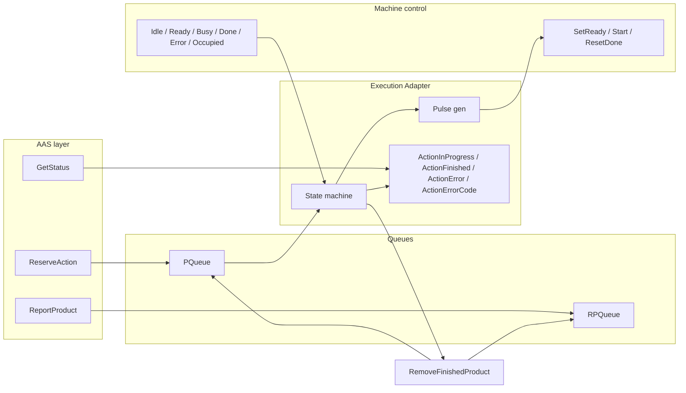
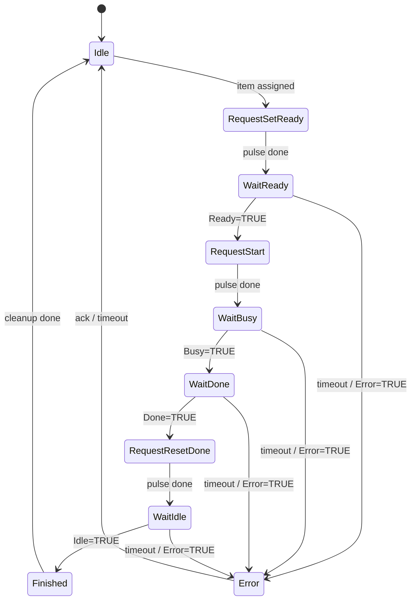

# PLC AAS Handshake Adapter – Implementation Plan

## 1. Current AAS method flow summary

### 1.1 Where AAS methods are handled (PLC)

All three methods are OPC UA server method blocks in **Active AAS_DB**, called by the OPC UA server when the reader invokes the corresponding NodeIds:

| Method            | PLC block path                                                                                                               | Current behaviour                                                                                                                                                                    |
| ----------------- | ---------------------------------------------------------------------------------------------------------------------------- | ------------------------------------------------------------------------------------------------------------------------------------------------------------------------------------ |
| **ReportProduct** | `[PLC_code/program_block/AAS/OPC UA Methods/ReportProduct.scl](PLC_code/program_block/AAS/OPC UA Methods/ReportProduct.scl)` | Parses `InputMessage` as decimal sr_id, pushes to **RPQueue** (ReportedProductsQueue). Returns `Success` or `Error:XXXX` (e.g. 8501 duplicate). Does not drive machine.              |
| **ReserveAction** | `[PLC_code/program_block/AAS/OPC UA Methods/ReserveAction.scl](PLC_code/program_block/AAS/OPC UA Methods/ReserveAction.scl)` | Parses 5-field `InputMessage` (sr_id/priority/material/paramA/paramB), validates support, pushes to **PQueue**. Returns `Success` or `Error:XXXX`. Does not start machine execution. |
| **GetStatus**     | `[PLC_code/program_block/AAS/OPC UA Methods/GetStatus.scl](PLC_code/program_block/AAS/OPC UA Methods/GetStatus.scl)`         | Finds item in PQueue by id (from `InputMessage`). Returns `position:N` or `inProgress` (if position = PQueue.activeItemPosition). No link to real machine state.                     |

Method blocks use **OPC_UA_ServerMethodPre** / **OPC_UA_ServerMethodPost** and set **Done/Busy/Error/Status** only for OPC UA method lifecycle; they do not read or write the machine interface (SetReady, Start, ResetDone, Idle, Ready, Busy, Done, Error, Occupied).

### 1.2 Current “execution” path (timer-based)

- **CheckAction** (`[PLC_code/program_block/Device Data/CheckAction.scl](PLC_code/program_block/Device Data/CheckAction.scl)`): Scans PQueue and ReportedProductsQueue to find an item that is in both; outputs `item`, `itemPositionP`, `itemPositionRP`.
- **DeviceSlow** (`[PLC_code/program_block/Device Data/DeviceSlow.scl](PLC_code/program_block/Device Data/DeviceSlow.scl)`): Receives the selected item and queue positions. Uses a **TON timer** to simulate completion: when `actionStatus = 'idle'` it sets `doAction := TRUE`, then after `waitTime` sets `finishedAction` and `deviceRunning := FALSE`, and writes `actionStatus := 'idle'`. It does **not** use SetReady/Start/ResetDone or Idle/Ready/Busy/Done/Error.
- **RemoveFinishedProduct**: Called when “finished”; removes item from both queues and updates history.
- **ActionStatus** (PassiveAAS_DB, ns=1;i=6100): Written by DeviceSlow as `'idle'` / `'inProgress'` / `'failed'`.

The reader (`[ESP32_Firmware_ASS_Interpreter/main/app.c](ESP32_Firmware_ASS_Interpreter/main/app.c)`) calls **ReportProduct → GetSupported → ReserveAction** then **OPC_AAS_WaitCompletion(30000)** (`[OPC_klient.c](ESP32_Firmware_ASS_Interpreter/components/OPC_Klient/OPC_klient.c)`): a fixed 30 s sleep with no polling of GetStatus or ActionStatus.

---

## 2. Proposed adapter architecture

### 2.1 Insertion point

Insert a new **Execution Adapter** between:

- **Above**: The logic that currently selects the “active” item (CheckAction or equivalent) and passes it to DeviceSlow.
- **Below**: The **real machine control** (which already exposes SetReady, Start, ResetDone and Idle, Ready, Busy, Done, Error, Occupied).

Two implementation options:

- **Option A (recommended)**: Add a new FB (e.g. **ExecutionAdapter**) that is called in the same cyclic scan where DeviceSlow is called. When the adapter is used, **do not** call DeviceSlow for the same item; the adapter drives the machine and, on Finished/Error, triggers queue cleanup (RemoveFinishedProduct) and updates AAS status.
- **Option B**: Keep DeviceSlow but feed its “start” and “finished” from the adapter: adapter runs the handshake and only when the adapter reaches Finished (or Error) does the cycle treat the action as done (DeviceSlow then becomes optional or is bypassed).

The adapter must:

- Run a **state machine** that issues SetReady → wait Ready → Start → wait Busy → wait Done → ResetDone → wait Idle.
- Generate **single-cycle pulses** for SetReady, Start, ResetDone.
- Expose **ActionInProgress**, **ActionFinished**, **ActionError**, **ActionErrorCode** (and optionally a string such as **ActionStatus** for GetStatus).
- Store **ProductID (sr_id)** in a dedicated tag so the machine program can read it.

Conceptual data flow:

### 2.2 What stays unchanged

- **ReportProduct**: Keep existing logic (push to RPQueue, return Success/Error:XXXX). No change to method body except optionally writing sr_id to the new **ProductID** tag for the machine if you want it available immediately after report.
- **ReserveAction**: Keep existing logic (validate, push to PQueue, return Success/Error). No change to method body.
- **GetStatus**: Change **only** the way **OutputMessage** is built: instead of (or in addition to) `position:N` / `inProgress`, derive the string from the adapter’s **ActionInProgress**, **ActionFinished**, **ActionError**, **ActionErrorCode** (see Section 5).

---

## 3. Detailed state machine description

### 3.1 States

| State                | Description                                                                                                                                                                                 | Next states                                                              |
| -------------------- | ------------------------------------------------------------------------------------------------------------------------------------------------------------------------------------------- | ------------------------------------------------------------------------ |
| **Idle**             | No execution in progress; adapter ready to accept “active” item.                                                                                                                            | RequestSetReady (when new item assigned), or stay Idle.                  |
| **RequestSetReady**  | Adapter has raised SetReady pulse (one cycle).                                                                                                                                              | WaitReady.                                                               |
| **WaitReady**        | Waiting for machine **Ready = TRUE**.                                                                                                                                                       | RequestStart (when Ready), Error (timeout or machine Error), or stay.    |
| **RequestStart**     | Adapter has raised Start pulse (one cycle).                                                                                                                                                 | WaitBusy.                                                                |
| **WaitBusy**         | Waiting for machine **Busy = TRUE**.                                                                                                                                                        | WaitDone (when Busy), Error (timeout or machine Error), or stay.         |
| **WaitDone**         | Waiting for machine **Done = TRUE**.                                                                                                                                                        | RequestResetDone (when Done), Error (timeout or machine Error), or stay. |
| **RequestResetDone** | Adapter has raised ResetDone pulse (one cycle).                                                                                                                                             | WaitIdle.                                                                |
| **WaitIdle**         | Waiting for machine **Idle = TRUE**.                                                                                                                                                        | Finished (when Idle), Error (timeout or machine Error), or stay.         |
| **Finished**         | Handshake complete. Adapter sets ActionFinished, triggers RemoveFinishedProduct, clears “active” item, then transitions to Idle.                                                            | Idle.                                                                    |
| **Error**            | Timeout in any wait state or machine **Error = TRUE**. Adapter sets ActionError and ActionErrorCode, optionally triggers cleanup; then transitions to Idle or a dedicated error-idle state. | Idle (after reset/ack) or Idle.                                          |

### 3.2 Transitions (summary)

- **Idle → RequestSetReady**: When the cyclic logic assigns the next item from PQueue (same condition that currently starts DeviceSlow).
- **RequestSetReady → WaitReady**: On the cycle after the SetReady pulse was output (pulse is one cycle).
- **WaitReady → RequestStart**: When **Ready = TRUE** (and not Error). Optional: require **Occupied** if that indicates “product at station”.
- **RequestStart → WaitBusy**: On the cycle after the Start pulse.
- **WaitBusy → WaitDone**: When **Busy = TRUE** (and not Error).
- **WaitDone → RequestResetDone**: When **Done = TRUE** (and not Error).
- **RequestResetDone → WaitIdle**: On the cycle after the ResetDone pulse.
- **WaitIdle → Finished**: When **Idle = TRUE** (and not Error).
- **Any wait state → Error**: On timeout for that state, or if **Error = TRUE**. Set **ActionErrorCode** (e.g. timeout code or machine error code).
- **Finished → Idle**: After cleanup (RemoveFinishedProduct, clear ActionFinished, clear current item).
- **Error → Idle**: After error handling and optional reset condition (e.g. ack or timeout).

### 3.3 State variable

- Use an **INT or ENUM** (e.g. **AdapterState**) with named constants for each state so the logic is readable and GetStatus can map state to string.

---

## 4. Mapping AAS calls to PLC commands and pulses

### 4.1 AAS methods vs machine commands

- **ReportProduct**: Does **not** drive the adapter or machine. Only fills RPQueue and optionally writes sr_id to **ProductID** for the machine.
- **ReserveAction**: Does **not** drive the adapter or machine. Only fills PQueue. The **cyclic logic** (scheduler) decides when the next item becomes “active” and passes it to the adapter; that is when the adapter leaves Idle and runs the handshake.
- **GetStatus**: Does **not** send commands. It **reads** adapter outputs (ActionInProgress, ActionFinished, ActionError, ActionErrorCode) and returns the appropriate string (Section 5).

So the mapping is:

- **Adapter state machine** ↔ **SetReady / Start / ResetDone** (outputs) and **Idle / Ready / Busy / Done / Error / Occupied** (inputs).
- **ReserveAction** only enqueues; **execution start** is when the scheduler assigns the item to the adapter (same moment that today would start DeviceSlow).

### 4.2 Pulse generation (single-cycle)

Machine commands **SetReady**, **Start**, **ResetDone** must be **one PLC cycle TRUE**, then FALSE.

**Recommended pattern (per command):**

- Reserve a **Bool** for the pulse output (e.g. **SetReady_Pulse**).
- Reserve a **Bool** “trigger” (e.g. **SetReady_Trigger**) that the state machine sets TRUE when entering **RequestSetReady**.
- In a dedicated section or the same FB:
  - **SetReady_Pulse := SetReady_Trigger** (so the pulse goes TRUE when requested).
  - On the **next** cycle, clear the trigger so the pulse goes FALSE: e.g. **IF SetReady_Pulse THEN SetReady_Trigger := FALSE; END_IF** (or use a one-shot: pulse is TRUE only for one scan after trigger).
- Ensure the physical **SetReady** (or the signal that the machine logic reads) is driven by **SetReady_Pulse** so the machine sees exactly one cycle.

Repeat the same pattern for **Start** and **ResetDone**. Use separate trigger/pulse pairs so only one command is pulsed per state and there is no overlap.

**Alternative (one-shot FB):** If the project has a rising-edge one-shot (e.g. SR or RS), use it: trigger on transition to RequestSetReady / RequestStart / RequestResetDone and output one cycle to SetReady / Start / ResetDone respectively.

---

## 5. Status reporting strategy for GetStatus

### 5.1 Adapter variables (to add in PLC)

Define in a DB or in the same FB instance that hosts the adapter:

- **ActionInProgress** (Bool): TRUE from RequestSetReady until Finished or Error (i.e. not Idle and not yet Finished/Error).
- **ActionFinished** (Bool): TRUE when state = Finished; clear when transitioning to Idle after cleanup.
- **ActionError** (Bool): TRUE when in Error state or when error condition is latched until reset.
- **ActionErrorCode** (Word or DInt): Error code (e.g. timeout code, or machine error code when **Error = TRUE**). 0 when no error.

Optional:

- **ActionStatus** (String/WString): Maintained for compatibility with existing **ActionStatus** (ns=1;i=6100). Set to `"running"`, `"finished"`, `"error:XXXX"` so the reader can poll this variable instead of calling GetStatus, if desired.

### 5.2 GetStatus OutputMessage format

**InputMessage** of GetStatus remains as today (e.g. sr_id or first element used as item id for PQueue lookup).

**OutputMessage** should reflect **execution** state for that item (or the current active item if only one execution at a time):

- **"running"**: Adapter state is one of RequestSetReady, WaitReady, RequestStart, WaitBusy, WaitDone, RequestResetDone, WaitIdle (i.e. **ActionInProgress = TRUE** and not Error).
- **"finished"**: Adapter just finished the handshake for this item (**ActionFinished = TRUE** and item id matches), or the item was already removed and the last completion was for this id. Optionally: return **"finished"** only while ActionFinished is TRUE and then switch to **"idle"** after cleanup.
- **"error:XXXX"**: **ActionError = TRUE**; XXXX = **ActionErrorCode** in hex (e.g. 4 digits). Example: timeout in WaitReady → **"error:T001"** if ActionErrorCode = 0xT001.

If the caller passes an item id that is not the current active item and not just finished:

- If item is still in queue (position ≠ active): keep current behaviour **"position:N"**.
- If item is not in queue and not current: **"idle"** or **"unknown"**.

So GetStatus logic:

1. Resolve item id from InputMessage (as now).
2. Find item in PQueue (as now). If not found, return **"idle"** or **"unknown"** (or existing error).
3. If found and this item is the **current active item** in the adapter: return **"running"** / **"finished"** / **"error:XXXX"** from adapter variables.
4. If found but not active (position ≠ activeItemPosition): return **"position:N"** (optional, for compatibility).

---

## 6. Timeout handling strategy

### 6.1 Per-state timeouts

Assign a **maximum dwell time** for each waiting state (WaitReady, WaitBusy, WaitDone, WaitIdle). Use a **TON** (or equivalent) that starts when entering the state and resets when leaving. If the timer elapses before the expected machine signal, transition to **Error** and set **ActionErrorCode** to a distinct value for that state.

Suggested defaults (to be adjusted to your machine):

| State                | Suggested timeout (example) | ActionErrorCode (example) |
| -------------------- | --------------------------- | ------------------------- |
| WaitReady            | 5 s                         | e.g. 0x0001               |
| WaitBusy             | 3 s                         | 0x0002                    |
| WaitDone             | 60 s (process time)         | 0x0003                    |
| WaitIdle             | 10 s                        | 0x0004                    |
| Machine Error = TRUE | —                           | 0x00FF or machine code    |

### 6.2 Implementation

- One **TON** instance (or one per wait state). When entering a wait state, set timer IN := TRUE and PT := chosen time. When the condition (Ready/Busy/Done/Idle) is met, leave the state and set timer IN := FALSE. In the state, if timer Q = TRUE, transition to Error and set ActionErrorCode.
- In **Error** state, optionally run a separate timeout to auto-reset to Idle (e.g. 30 s) so the next item can run, or require an explicit reset (e.g. from HMI or AAS).

---

## 7. ProductID (sr_id) storage for the machine program

- Add a tag (e.g. **ProductID** or **CurrentProductId**) of type **DInt** or **String** in a DB that the **machine program** can read (same DB as adapter or a shared interface DB).
- When the adapter **accepts** the active item (transition Idle → RequestSetReady), copy **item.id** (sr_id) into **ProductID**.
- Optionally, when ReportProduct succeeds, write the reported sr_id to a **ReportedProductID** so the machine can prepare before the item becomes active (if your architecture needs it).
- Clear **ProductID** when transitioning to Idle after Finished or Error (or when removing the item).

This gives the machine one clear place to read “which product is currently at the station” (or “which product the adapter is executing”).

---

## 8. Step-by-step implementation plan (manual in TIA Portal)

1. **Tags / DB for machine interface**
  Create or identify the DB that holds machine inputs/outputs. Ensure these exist and are wired to the machine logic:  
  - **Inputs (from machine)**: Idle, Ready, Busy, Done, Error, Occupied (Bool).  
  - **Outputs (to machine)**: SetReady, Start, ResetDone (Bool). Plan to drive them via pulse variables (e.g. SetReady_Pulse, Start_Pulse, ResetDone_Pulse).
2. **Adapter DB / instance**
  Create a global DB or an FB instance for the Execution Adapter. Add variables:  
  - AdapterState (INT/ENUM), ActionInProgress, ActionFinished, ActionError, ActionErrorCode (Word/DInt),  
  - SetReady_Trigger, Start_Trigger, ResetDone_Trigger,  
  - SetReady_Pulse, Start_Pulse, ResetDone_Pulse,  
  - CurrentItemId, CurrentItemPositionP, CurrentItemPositionRP (for RemoveFinishedProduct and GetStatus),  
  - ProductID (DInt or String) for the machine,  
  - Optional: ActionStatus (String/WString).  
   Add one TON (or more) for timeouts and any “error recovery” timer.
3. **Pulse generation**
  Implement one-cycle pulse logic for SetReady, Start, ResetDone (Section 4.2). Wire SetReady_Pulse, Start_Pulse, ResetDone_Pulse to the actual machine command signals (or map them in the machine’s input area).
4. **State machine**
  Implement the state machine (Section 3) in SCL or LAD:  
  - Idle: if “new item assigned” (from CheckAction / scheduler), copy item and positions, set AdapterState := RequestSetReady, set SetReady_Trigger.  
  - RequestSetReady: next cycle → WaitReady.  
  - WaitReady: if Ready AND NOT Error → RequestStart, set Start_Trigger; if Error or timeout → Error.  
  - Continue similarly for RequestStart → WaitBusy → WaitDone → RequestResetDone → WaitIdle → Finished.  
  - Finished: call RemoveFinishedProduct with CurrentItemPositionRP, CurrentItemPositionP, CurrentItemId; clear ActionFinished after cleanup; clear ProductID; AdapterState := Idle.  
  - Error: set ActionError, ActionErrorCode; optional cleanup or retry policy; then AdapterState := Idle (after timeout or ack).
5. **Scheduler integration**
  In the cyclic block that currently calls CheckAction and DeviceSlow:  
  - Call CheckAction. If foundItem and adapter is in Idle, pass the item and positions to the adapter (assign “current” item and transition adapter to RequestSetReady). Do **not** call DeviceSlow for that item when the adapter is in use.  
  - If adapter is not Idle, do not assign a new item (single execution).  
  - Call the adapter FB every cycle so it can advance states and generate pulses.
6. **GetStatus changes**
  In GetStatus method block:  
  - After resolving item id and PQueue position (existing logic), check whether this item is the adapter’s current item (CurrentItemId = tempItemId) and adapter is running or just finished.  
  - If yes: set OutputMessage from adapter state: ActionInProgress → **"running"**, ActionFinished (and id match) → **"finished"**, ActionError → **"error:"** + ActionErrorCode as hex string.  
  - Otherwise keep existing **"position:N"** / **"inProgress"** behaviour if desired.
7. **ActionStatus (PassiveAAS_DB)**
  If ActionStatus (ns=1;i=6100) is to reflect execution: in the adapter, write **ActionStatus** := `"running"` / `"finished"` / `"idle"` / `"error:XXXX"` from the same conditions as GetStatus, so the reader can poll this variable instead of calling GetStatus for completion.
8. **Timeouts**
  Implement TON(s) for WaitReady, WaitBusy, WaitDone, WaitIdle; on Q = TRUE, transition to Error and set ActionErrorCode. Test with values that match your machine response times.
9. **ProductID**
  When adapter takes the item (Idle → RequestSetReady), set ProductID := item.id. When leaving to Idle (after Finished or Error), clear ProductID. Document the tag name and DB for the machine program.
10. **Reader firmware (later)**
  After the PLC changes are in place: replace **OPC_AAS_WaitCompletion(timeout)** with a loop that polls **GetStatus** (or ActionStatus) until **"finished"** or **"error:XXXX"** or a global timeout; then proceed to write-back. This is out of scope for “PLC-only” but is the intended consumer of the new behaviour.

---

## 9. Summary diagram (adapter state flow)

This plan is limited to architecture and implementation instructions; no PLC code is generated. Implement the steps manually in TIA Portal and adjust timeouts and error codes to your machine and safety requirements.